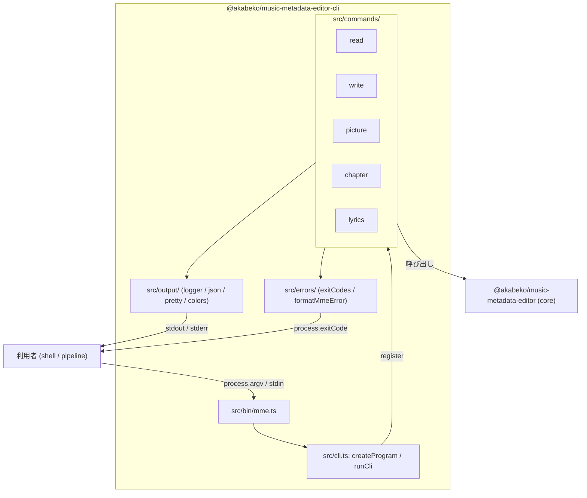
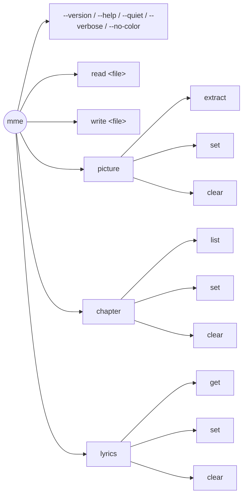
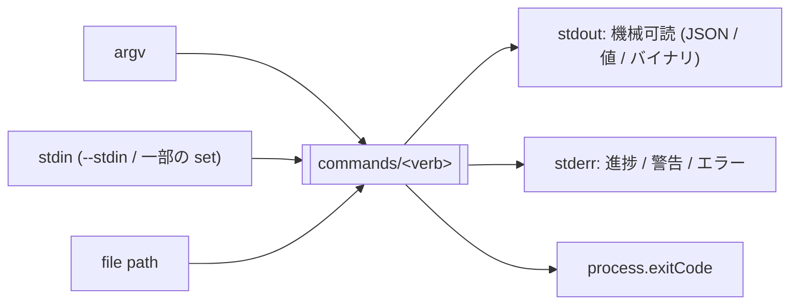

# cli 設計概要

`@akabeko/music-metadata-editor-cli` (以下 cli) は、core ライブラリー (`@akabeko/music-metadata-editor`) を **`mme` コマンド** として提供する commander ベースの CLI です。本ドキュメントは新規メンバーが cli の構造をひとまず把握するための入門資料です。詳細はソース・テスト・ [`plan/README.md`](plan/README.md) を参照してください。

> 計画索引: [`plan/README.md`](plan/README.md) ／ `/security-review` 結果: [`security-review/`](security-review/) ／ ルール: [`../../rules/README.md`](../../rules/README.md)

## 1. 役割

- core の **4 つの公開 API** (`loadTrack` / `saveTrack` / `readMetadata` / `writeMetadata`) をシェルから呼び出せる薄いフロント エンドにする。
- pipeline 利用 (`cat in.mp3 | mme read --stdin --format mp3`) と通常のファイル操作の両方をサポートする。
- **stdout は機械可読 JSON 既定**、進捗 / 警告 / エラーは stderr。`jq` や他の Unix tool と素直に組み合わせられるようにする。

非ゴール:

- core の機能を増やす (CLI 側で audio / format ロジックを書かない)
- インタラクティブ TUI (将来の GUI パッケージで担当)
- バッチ処理エンジン (1 ファイル単位の操作に集中)

## 2. レイヤー構成



役割を 1 行で:

- **`src/bin/mme.ts`**: shebang つきの bin エントリー。`uncaughtException` / `unhandledRejection` のセーフ ネット + `process.exitCode` の設定だけを担当する薄い層。
- **`src/cli.ts`**: `createProgram` で commander の `Command` を組み立て、`runCli` で in-process 実行 (テスト用) を提供。
- **`src/commands/<verb>/`**: サブコマンドごとのフォルダ。`<verb>.ts` (commander 配線) と `parse*Options.ts` / `handle*.ts` (純関数化されたロジック) に分かれる。
- **`src/output/`**: `logger` (process-wide), JSON / pretty レンダラ、色制御。stdout / stderr の出力は **必ずここを通す**。
- **`src/errors/`**: `ExitCode` 表と `formatMmeError` (例外 → 終了コード + メッセージ)。
- **`src/types.ts`**: CLI 内部で共有する型 (`CliContext` / `CliGlobalOptions` / `RunResult`)。

## 3. コマンド ツリー



| コマンド | 主用途 | core の窓口 |
| --- | --- | --- |
| `mme read <file>` | タグ全体を読み出す (JSON / pretty / 単一フィールド) | `loadTrack` (ファイル) / `readMetadata` (`--stdin`) |
| `mme write <file>` | タグ フラグ / JSON / `--tag-file` で部分書き換え | `saveTrack` (ファイル) / `writeMetadata` (`--stdin --output -`) |
| `mme picture <verb>` | 埋め込み画像の取り出し / 設定 / クリア | `loadTrack` + `saveTrack` |
| `mme chapter <verb>` | 章 (ID3 CHAP / MP4 chap) の操作 | `loadTrack` + `saveTrack` |
| `mme lyrics <verb>` | 歌詞 (text / LRC / JSON) の操作 | `loadTrack` + `saveTrack` |

各サブコマンドの仕様は [`plan/`](plan/) のフェーズ別 Markdown を正本とします。

## 4. ランタイム フロー

```mermaid
sequenceDiagram
    autonumber
    participant Shell
    participant Bin as bin/mme.ts
    participant Program as createProgram
    participant Cmd as commands/&lt;verb&gt;
    participant Output as output/logger
    participant Core as core API
    participant Errors as errors/formatMmeError

    Shell->>Bin: process.argv / stdin
    Bin->>Program: createProgram(context).parseAsync
    Program->>Program: preAction → installLoggerFromOptions
    Program->>Cmd: subcommand action
    Cmd->>Cmd: parse*Options(rawOpts)
    Cmd->>Core: loadTrack / saveTrack / readMetadata / writeMetadata
    Core-->>Cmd: Track / Bytes / MetadataReadResult
    Cmd->>Output: writeJson / writePretty / log warning
    Output-->>Shell: stdout / stderr
    Cmd-->>Program: 完了
    Program-->>Bin: 正常終了 → ExitCode.Success
    Bin->>Bin: process.exitCode = 0

    Note over Cmd,Errors: 例外発生時
    Cmd-->>Program: throw (CommanderError / MmeError / Error)
    Program-->>Bin: rethrow
    Bin->>Errors: formatMmeError(error)
    Errors-->>Bin: { message, exitCode }
    Bin->>Output: logger.error(message)
    Bin->>Bin: process.exitCode = exitCode
```

ポイント:

- `commander` の `exitOverride()` を有効にし、**`process.exit` は使わず `process.exitCode` を立てる** だけにすることで、Node ランタイムが pending I/O を flush し終えてから終了できる。
- `runCli` (テスト用) と bin (`mme.ts`) は同じ `createProgram` を共有するため、本番経路とテスト経路でロジックが分岐しない。
- `preAction` フックで `--quiet` / `--verbose` / `--no-color` を解析し、process-wide の `Logger` を確定させてから handler を呼ぶ。

## 5. 入出力規約



- **stdout は CLI の出力結果のみ**。`mme write --stdin --output -` のようにバイナリを流すケースとぶつからないよう、ログは必ず stderr。
- **既定は JSON、`--pretty` で人間向け**。`--field <name>` 指定時は値そのもの (quote なし) を 1 行で。
- 色は stderr のみ。`NO_COLOR` / `FORCE_COLOR` 環境変数を尊重 (`output/colors.ts`)。
- `--quiet` と `--verbose` の同時指定は意図不明として **exit code 2 (Usage)**。

## 6. 終了コード

| Code | 区分 | 主な発生源 |
| --- | --- | --- |
| `0` | `Success` | 正常終了 |
| `1` | `Failure` | 未分類 / `MmeError` で未マップのコード |
| `2` | `Usage` | commander の引数エラー、`--quiet` + `--verbose` |
| `3` | `UnsupportedFormat` | `MmeError.code === "unsupported-format"` |
| `4` | `IoError` | ファイル / stream I/O 失敗 |
| `5` | `InvalidTag` | `MmeError.code === "invalid-tag"` |

正本は [`plan/phase-01-foundation.md`](plan/phase-01-foundation.md)。`exitCodes.ts` の `exitCodeForMmeError` テーブルが **疎** に保たれているのは意図的で、core が新しい `MmeErrorCode` を増やしても CLI が明示的に分類するまで `1 (Failure)` にフォールバックするためです。

## 7. テスト戦略

- 単体テスト (`*.test.ts`): `parseTagOverrides` などの純関数を中心に。
- E2E (`cli.test.ts`): `runCli(argv, { stdin })` で in-process 実行し、`stdout` / `stderr` / `exitCode` を検証。
- フィクスチャ生成: `packages/cli/scripts/fixtures/<fmt>.ts` (`pnpm fixtures:<fmt>`)。core 側のフィクスチャと同じ規約。
- 子プロセス起動は **使わない** (起動時間がコストなのと、`stdoutBytes` を直接観測できる方が assertion が素直なため)。

## 8. 拡張ポイント

新しいサブコマンド (例: `mme tag <verb>`) を追加するときの典型的な手順:

1. `src/commands/<verb>/<verb>.ts` で `createXxxCommand(): Command` を定義。
2. `parseXxxOptions.ts` (純関数) と `handleXxx.ts` (副作用込み) に分割し、それぞれ `*.test.ts` を併置。
3. `src/cli.ts` の `createProgram` で `addCommand(...)` を追加。
4. 出力は必ず `output/` のヘルパー経由で行い、`logger` を直接 console に置き換えない。
5. 終了コードを増やすときは `errors/exitCodes.ts` の `ExitCode` に追加し、`exitCodeForMmeError` も必要に応じて更新 (このタイミングで `plan/phase-01-foundation.md` の表もアップデートする)。

## 9. 参考リンク

- 利用者向けガイド: [`packages/cli/README.ja.md`](../../../packages/cli/README.ja.md)
- core 設計概要: [`../core/architecture.md`](../core/architecture.md)
- 開発ルール (コード スタイル / テスト / Git): [`../../rules/README.md`](../../rules/README.md)
- 実装計画 (Phase 単位): [`plan/README.md`](plan/README.md)
