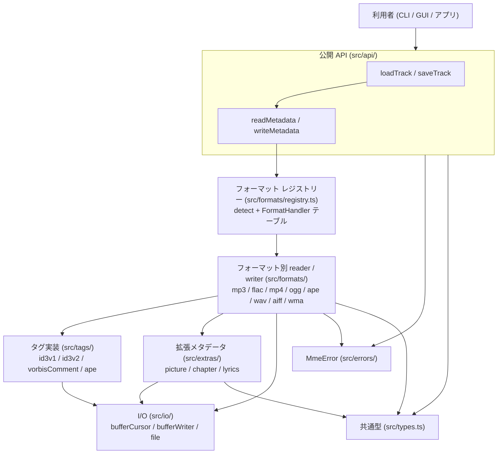
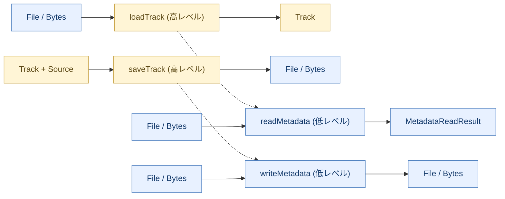
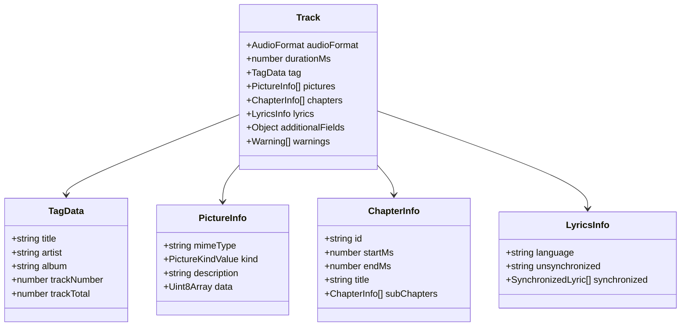
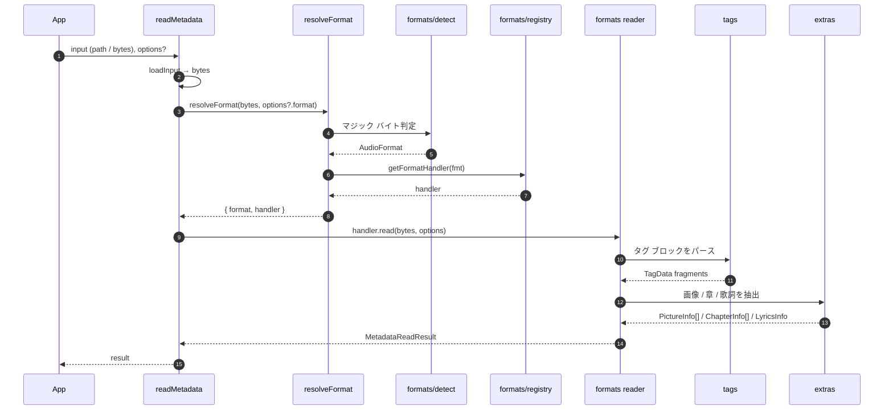
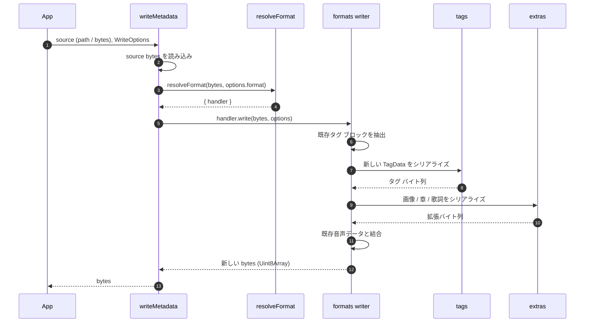

# core 設計概要

`@akabeko/music-metadata-editor` (以下 core) は、音楽ファイルのメタデータを **読み書き** する Node.js + TypeScript 製ライブラリーです。本ドキュメントは新規メンバーが core の構造をひとまず把握するための入門資料です。詳細はソース・テスト・ [`plan/README.md`](plan/README.md) を参照してください。

> 計画索引: [`plan/README.md`](plan/README.md) ／ `/security-review` 結果: [`security-review/`](security-review/) ／ ルール: [`../../rules/README.md`](../../rules/README.md)

## 1. 役割

- 音楽ファイル (MP3 / FLAC / MP4 / OGG / APE / WAV / AIFF / WMA) のメタデータを **共通の `Track` モデル** で扱えるようにする。
- 読み書きの **正本フロー** (バイナリ → 内部モデル → バイナリ) を提供し、CLI や GUI など上位層はそこに乗るだけにする。
- 参考実装は [ATL.NET (Zeugma440/atldotnet)](https://github.com/Zeugma440/atldotnet) ですが、コードはそのまま移植せず Node.js + TypeScript として再設計しています。

非ゴール:

- オーディオ デコード / 再生
- ファイル形式の変換 (フォーマット間トランスコード)
- 巨大ファイルのストリーミング書き込み (現状は in-memory リビルドが基本)

## 2. レイヤー構成

役割を 1 行で:

- **`src/api/`**: 公開 API の本体。フォーマットに依存しないオーケストレーション。
- **`src/formats/`**: コンテナごとの reader / writer。`registry.ts` に自分を登録する自己完結モジュール。
- **`src/tags/`**: タグ形式 (ID3v1/v2、Vorbis Comment、APE Tag) のパーサー / ビルダー。複数の format から共有される。
- **`src/extras/`**: 画像・章・歌詞のフォーマット非依存モデルと、各タグ形式 ↔ モデルの相互変換アダプタ。
- **`src/io/`**: バッファ・ファイルの低レベル I/O ヘルパー。
- **`src/utils/`**: 文字エンコーディング、syncsafe int などの汎用ユーティリティ。
- **`src/errors/mmeError.ts`**: 単一の `MmeError` 階層 (`MmeErrorCode` で分類)。
- **`src/types.ts`**: 公開型の単一ファイル。`Track` / `TagData` / `PictureInfo` / `ChapterInfo` / `LyricsInfo` などすべてここに集約。

## 3. 公開 API

`src/mme.ts` がライブラリーのエントリ ポイントです。`import` された時点ですべての format ハンドラを `registry` に登録するため、利用側は format を意識せずに 4 つの API を呼べます。

| API | 想定ユース | 入力 | 出力 |
| --- | --- | --- | --- |
| `loadTrack(input, options?)` | アプリ内で **不変モデル** として扱いたい | パス or `Uint8Array` | `Track` (`additionalFields` / `warnings` が常に存在) |
| `saveTrack(track, options)` | 編集後の `Track` をファイル / バイト列に書き戻す | `Track` + `SaveTrackOptions` | `Uint8Array` (出力先未指定 + Buffer 入力時のみ) |
| `readMetadata(input, options?)` | 低レベル: `MetadataReadResult` を直接扱う / `tagPriority` を制御したい | パス or `Uint8Array` | `MetadataReadResult` |
| `writeMetadata(source, options)` | 低レベル: `WriteOptions` で部分書き込み | パス or `Uint8Array` + `WriteOptions` | `Uint8Array` |

`loadTrack` / `saveTrack` は内部で `readMetadata` / `writeMetadata` をラップし、出力フィールドを正規化するだけです。ロジックの本体は低レベル側にあります。

### `Track` を中心とした不変モデル

> 図中のフィールドは型のみを示しています。実際の TypeScript 定義では多くがオプショナル (`?`) で、正本は `src/types.ts` を参照してください。

`Track` はすべて `readonly` で **編集はスプレッドで新オブジェクトを作る** スタイルです。setter は意図的に提供しません (`docs/rules/code-style.md` の方針)。

## 4. 読み込みフロー

### `tagPriority` (MP3 のみ)

MP3 は ID3v2 / APE / ID3v1 が同時に存在しうる唯一のコンテナーです。`ReadOptions.tagPriority` の順番で **先勝ち** マージし、未指定時のデフォルトは ATL.NET と同じ `["id3v2", "ape", "id3v1"]` です。

## 5. 書き込みフロー

書き込みのポイント:

- **タグ部分のみ差し替え、音声フレームは無加工**。FLAC / MP4 などはパディングや atom 構造を保つように再構築します。
- `WriteOptions.pictures` / `chapters` / `lyrics` は **省略時は既存値を保持**、配列を渡すと **丸ごと差し替え** という二択モデルです。
- `saveTrack` はファイルへの書き戻し / Buffer 戻り値の使い分けを担当します。プロセスの **一時ファイル + rename** はファイル形式によって writer 側が担当します。

## 6. フォーマット レジストリー

`src/formats/registry.ts` には format ID → reader / writer / detect のテーブルがあり、各 format モジュール (`formats/<fmt>/<fmt>.ts`) が自分の `register<Fmt>Format()` で登録します。`mme.ts` がライブラリーのエントリで全 format を初期化済みにすることで、利用者は import するだけで全フォーマット対応になります。

新フォーマットを追加する手順:

1. `src/formats/<fmt>/` を作成 (`detect<Fmt>.ts` / `read<Fmt>/` / `write<Fmt>/`)。
2. `register<Fmt>Format()` を export し、`registry.register(...)` を呼ぶ。
3. `src/types.ts` の `AudioFormat` ユニオンに ID を追加。
4. `src/mme.ts` で新しい `register<Fmt>Format()` を呼び出す。
5. テスト用 fixture を `packages/core/scripts/fixtures/<fmt>.ts` に追加し、`pnpm fixtures:<fmt>` で生成できる状態にする。

## 7. タグと extras の関係

タグ形式 (ID3v2 など) は **複数のフォーマットから共有** されます。たとえば ID3v2 は MP3 / WAV / AIFF が利用しますし、Vorbis Comment は FLAC / OGG が利用します。`src/tags/` 配下にコアな読み書きを置き、format 固有の取り回し (どの atom / chunk に埋めるか) は format 側で持ちます。

`src/extras/<scope>/converters/` には **タグ形式とフォーマット非依存モデル (`PictureInfo` / `ChapterInfo` / `LyricsInfo`) の相互変換** が並びます。たとえば:

- `apicToPicture` / `pictureToApic` ↔ ID3v2 APIC frame
- `flacPictureToPicture` / `pictureToFlacPicture` ↔ FLAC PICTURE block
- `chapToChapter` / `chapterToChap` ↔ ID3v2 CHAP frame
- `usltToLyrics` / `lyricsToUslt` ↔ ID3v2 USLT frame

新しい変換ルールを追加するときは converter を 1 ファイル 1 関数で増やし、テスト (`*.test.ts`) を併置します (`docs/rules/code-style.md`)。

## 8. エラーと警告

- 致命的な問題は **`MmeError` (`src/errors/mmeError.ts`) を throw**。`code` (`MmeErrorCode`) で分類し、CLI 側の終了コード マップに使われます。
- **部分的な破損** は throw せず `Warning[]` (`MetadataReadResult.warnings` / `Track.warnings`) に積みます。これにより「壊れた frame は捨てつつ、残りは復元」という挙動を実現します。
- 上位層 (CLI など) は `warnings` を表示するか抑止するかをユーザーの flag で決めます。

## 9. テストとフィクスチャ

- 単体テスト: `*.test.ts` を実装ファイルにコロケーション (`docs/rules/test-strategy.md`)。
- ラウンドトリップ: `loadTrackRoundtrip.test.ts` で「読み → 書き → 読み」が安定することを確認。
- フィクスチャ生成: `packages/core/scripts/fixtures/<fmt>.ts` をスクリプトとして実行 (`pnpm fixtures:<fmt>`)。バイナリはコミットせず、必要に応じて再生成します。

## 10. 参考リンク

- 公開 API の使用例: [`packages/core/README.ja.md`](../../../packages/core/README.ja.md)
- フィールド対応表 (各タグ形式 ↔ `TagData`): [`../../field-mapping.ja.md`](../../field-mapping.ja.md)
- 開発ルール (コード スタイル / テスト / Git): [`../../rules/README.md`](../../rules/README.md)
- 実装計画 (Phase 単位): [`plan/README.md`](plan/README.md)
- 参考実装 ATL.NET: <https://github.com/Zeugma440/atldotnet>
