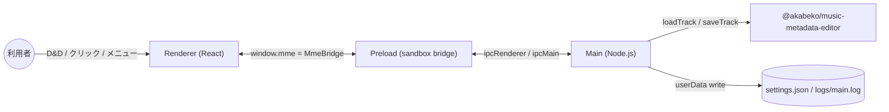
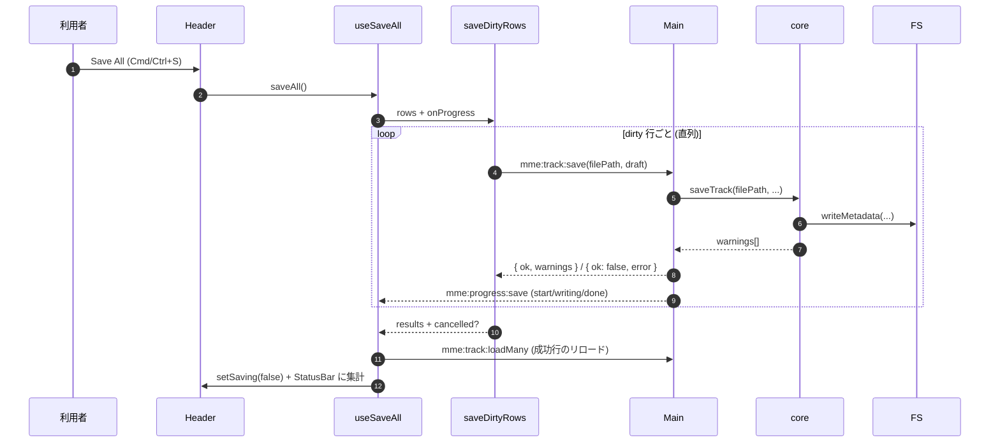

# gui 設計概要

`@akabeko/music-metadata-editor-gui` (以下 gui) は、core ライブラリー (`@akabeko/music-metadata-editor`) をスプレッドシート ベースで編集できる **Electron デスクトップ アプリ** として提供します。本ドキュメントは Phase 1〜7 で確定した構造をひとまず把握するための入門資料です。詳細はソース・テスト・ [`plan/README.md`](plan/README.md) を参照してください。

> 計画索引: [`plan/README.md`](plan/README.md) ／ `/security-review` 結果: [`security-review/`](security-review/) ／ ルール: [`../../rules/README.md`](../../rules/README.md)

## 1. 役割

- **複数の音楽ファイルを 1 画面で読み・編集・保存** できる GUI を提供する。
- core が公開する型 (`Track` / `TagData` / `PictureInfo` / `LyricsInfo` / `ChapterInfo`) をそのまま編集可能なテーブルに展開する。
- CLI と同じ「最小依存・OS 標準路線」のサプライ チェーンを保つ (Renderer は React + Tailwind + shadcn/ui + base-ui のみ、Main は Electron + electron-log + core)。

非ゴール (v1):

- 多並列 saveTrack / WebWorker でのバックグラウンド処理
- macOS の署名・公証
- 自動アップデート (`electron-updater`)
- 複数行のバッチ編集 / ドラッグでの行並び替え

## 2. 3 プロセス構成

Electron の標準的な 3 プロセス分離をそのまま採用しています。境界は `dist/main`・`dist/preload`・`dist/renderer` の 3 つの Vite ビルドに対応します。



| プロセス | エントリー | 役割 |
| --- | --- | --- |
| Main | `src/main/main.ts` | BrowserWindow 生成、IPC ルーティング、core 呼び出し、設定 / ログ / 致命例外 / メニュー制御 |
| Preload | `src/preload/preload.ts` | `contextBridge.exposeInMainWorld("mme", ...)` で `MmeBridge` を公開。Renderer ↔ Main の唯一の橋 |
| Renderer | `src/renderer/renderer.tsx` | React + Tailwind の UI。`window.mme` 経由で IPC を呼ぶ以外、Node API には触れない |

`webPreferences` は `contextIsolation: true` / `nodeIntegration: false` / `sandbox: true`。Renderer は Node に到達できない設計です。

## 3. ディレクトリー構成 (要約)

```
src/
  main/
    main.ts                # whenReady 〜 will-quit
    ipc/                   # IpcKeys / on*.ts ハンドラー / types.ts (MmeBridge の型)
    settings/              # settings.json の読み書き、debounce flush、mergeSettings
    locales/               # en / ja 辞書 + t() / resolveLocale (Renderer もここを参照)
    menu/                  # buildAppMenu (純関数) / installAppMenu / menuController
    dnd/                   # expandDroppedPaths (フォルダ再帰展開、深さ 3、symlink skip)
    fatal/                 # uncaughtException / unhandledRejection の Renderer 通知
    logging/               # electron-log の初期化
  preload/
    preload.ts             # window.mme バインディング
  renderer/
    App.tsx                # SettingsProvider + AppShell
    components/
      app/
        AppShell/          # 主要 UI とフック (useAppShell が view-model 集約)
        AboutDialog/       # Help → About
        FatalDialog/       # Main → mme:fatal で発火するモーダル
        LyricsDialog/, PicturesDialog/, Spreadsheet/
      ui/                  # shadcn/ui ベースのプリミティブ
    features/
      tracks/              # 開いているファイルの集合 (Track + warnings)
      edit/                # ドラフトとオリジナルの差分管理 (undo / redo / paste)
      save/                # 直列 saveDirtyRows / 進捗集計
      settings/            # mme:settings:get/set のラッパ + UpdateSettings
      spreadsheet/         # 列レジストリ・ヘッダー・セル レンダー
      dnd/                 # window への drop ハンドラー (Main の expandPaths を呼ぶ)
      theme/               # AppSettings.theme + prefers-color-scheme → document class
      i18n/                # useLocale (Renderer 側で main/locales を読む)
      pictures/, lyrics/
```

`tsconfig.web.json` の `include` には Renderer の他に `src/main/locales/**/*.ts` を加えており、辞書モジュール (純関数) を Renderer からも参照できます。Main / Renderer の値レベル相互参照はこの辞書 + `IpcKeys` (preload で利用) のみです。

## 4. IPC チャネル一覧 (`mme:<resource>:<verb>`)

`src/main/ipc/ipcKeys.ts` の定数を Renderer / Preload / Main の三方が同じ識別子で参照します。

| チャネル | 方向 | 概要 |
| --- | --- | --- |
| `mme:app:getVersions` | Renderer→Main | core / gui / electron / chrome / node のバージョン |
| `mme:dialog:openFiles` | Renderer→Main | ファイル選択ダイアログ |
| `mme:dialog:saveFile` | Renderer→Main | 保存ダイアログ |
| `mme:dialog:expandPaths` | Renderer→Main | D&D されたパス群を audio ファイルへ展開 (深さ 3 / symlink skip) |
| `mme:track:load` / `loadMany` / `save` | Renderer→Main | core への単発 / バッチ読み込み / 書き込み |
| `mme:file:readBytes` / `writeBytes` | Renderer→Main | 単発バイナリ I/O (ピクチャ / 歌詞ファイル) |
| `mme:formatSupport:list` | Renderer→Main | フォーマットごとの編集可能フィールド一覧 |
| `mme:settings:get` / `set` | Renderer→Main | 永続設定の取得 / patch |
| `mme:menu:setState` | Renderer→Main | dirty / recent / theme / columns をメニューへ反映 |
| `mme:menu:action` | Main→Renderer | ネイティブ メニュー押下を Renderer に流す |
| `mme:progress:save` | Main→Renderer | 1 ファイル保存ごとの進捗 |
| `mme:fatal` | Main→Renderer | uncaughtException → モーダル表示 |
| `mme:fatal:report` | Renderer→Main | Renderer 側 onerror をログへ |
| `mme:log:forward` | Renderer→Main | console.error / warn を `userData/logs/main.log` へ転送 |

すべての invoke 系チャネルは `IpcResult<T>` (`{ ok: true, value }` または `{ ok: false, error: IpcError }`) で正規化しています。`Error` インスタンスは IPC を越えないため、`toIpcError` で plain object に詰め替えます。

## 5. 書き込みシーケンス (Save All)



`mme:track:save` は **直列** に流します。core 内部の writeMetadata が IO バインドであることと、書き込み失敗時のロールバック判断を Renderer 側で簡潔にするためです。並列化は今後の最適化候補 (Phase 7 plan の "v1 で入れない" 参照)。

## 6. 設定ファイル (`<userData>/settings.json`)

`src/main/settings/` が単独で管理します。

- 形式: `AppSettings` (`version: 1`, `columns`, `window`, `recentFiles`, `locale?`, `theme?`)
- 書き込み: 500 ms debounce + atomic write (`tmp` → `rename`)
- 読み込み: 起動時に同期読み込み。JSON が壊れていれば `defaultSettings` にフォールバック
- マイグレーション: `version` キーは patch から無視され、`current.version` で固定。スキーマを上げる際はここに `migrate(v1→v2)` を追加する想定

`mergeSettings` は **明示フィールド戦略** (汎用 deep-merge を避ける) で prototype pollution を構造的に塞いでいます。詳細は [`security-review/v0.0.0.md`](security-review/v0.0.0.md) の「LOW-1〜4」と「良い点 4」参照。

## 7. メニュー / D&D / テーマ / i18n

- **メニュー**: `buildAppMenu(state, locale)` は **純関数** で `MenuTemplate` を返します。`installAppMenu` が `Menu.buildFromTemplate` への変換と `click → mme:menu:action` 配線を担当。`menuController` が動的 state を保持し、Renderer の `mme:menu:setState` で再構築します。
- **D&D**: Renderer は `useDragAndDrop` で `dragover` / `drop` を捕捉。`webUtils.getPathForFile` で File → 絶対パスを得たあと `mme:dialog:expandPaths` で Main 側に展開させます。深さ制限 3、symlink skip、拡張子フィルタ。
- **テーマ**: `AppSettings.theme` (`light` / `dark` / `system`) と `prefers-color-scheme` を `useTheme` が合成し、`document.documentElement` に `light` / `dark` クラスを付与。Tailwind の dark variant がそのまま効きます。
- **i18n**: `src/main/locales/{en,ja}.ts` のフラット辞書 + `t(key, locale)` ルックアップ。i18next 等は不採用 (キー数が少ないため自前で十分)。Renderer は `useLocale` 経由でアクセス。

## 8. 致命的例外と Logging

- Main の `uncaughtException` / `unhandledRejection` は `setupFatalHandlers` が捕捉し、`mme:fatal` で Renderer に通知します。Renderer は `<FatalDialog>` を表示し `Reload` / `Quit` を選ばせます。
- Renderer 側の `window.onerror` / `window.onunhandledrejection` も同様にモーダル表示し、`mme:fatal:report` で Main のログに記録します。
- `electron-log` は `setupLogger` で初期化し、`<userData>/logs/main.log` (1 MB ローテーション) と stdout 双方に出力します。Renderer の `console.error` / `console.warn` は `useLogForwarder` で `mme:log:forward` 経由で Main に集約されます。

## 9. テスト戦略

- 純関数 (`buildAppMenu` / `expandDroppedPaths` / `t` / `resolveLocale` / `mergeSettings` / `saveDirtyRows` / `formatSaveSummary` / `expandColumnPaste` ...) は Vitest でユニット テスト。
- React コンポーネントは `Spreadsheet.test.tsx` のように Testing Library でレンダリング検証。
- Electron の `BrowserWindow` / `Menu` / `dialog` は **モックしない**。`installAppMenu` のような薄いラッパは pure builder 経由で間接検証する方針。
- electron-builder の出力検証は CI に組み込みません。Phase 7 末に macOS / Linux / Windows でそれぞれ 1 回手動確認。

## 10. リリース手順

[`plan/phase-07-polish.md`](plan/phase-07-polish.md) の「配布手順」を踏襲します。要点:

1. `packages/gui/package.json` の `version` を bump。
2. `pnpm -r typecheck` / `pnpm -r test` / `pnpm check` / `pnpm --filter @akabeko/music-metadata-editor-gui build` を全て緑にする。
3. `/security-review` を実施し、`docs/pkg/gui/security-review/v<version>.md` に結果を残す。
4. PR (`pkg:gui` ラベル) を出してマージ後、`pnpm --filter @akabeko/music-metadata-editor-gui package` で成果物を生成。
5. GitHub Releases に手動アップロード。タグは `gui-v<version>`。

## 11. 参考実装と取り込み元

`plan/phase-01-foundation.md` で確定した electron-starter リポジトリの取り込みコミットを記録するセクションです。差分追従が必要になった際はここを参照してください。

| 項目 | 値 |
| --- | --- |
| 取り込み元 | `akabekobeko/electron-starter` |
| 取り込み時 SHA | (Phase 1 取り込み時のコミット — 必要に応じてユーザーに確認) |
| 取り込み内容 | Vite × 3 ビルド構成、`scripts/dev.mjs`、`scripts/sync-electron-targets.mjs`、`tsconfig.{node,web}.json` の雛形 |
