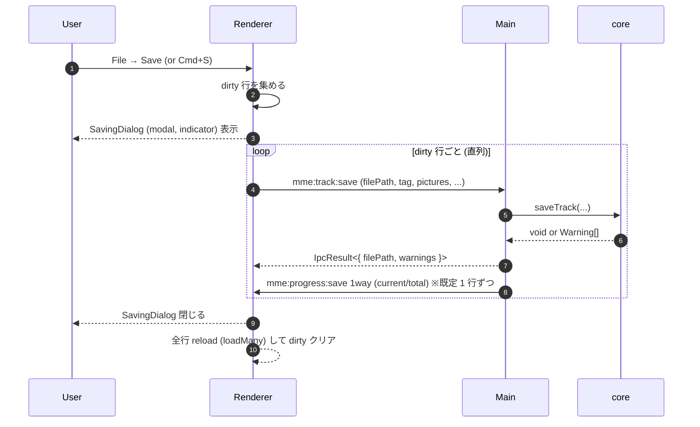

# Phase 6: Settings & Write

## 目的

ユーザー設定 (列表示 ON/OFF など) を **Main プロセスのユーザー領域 (JSON)** に永続化し、`saveTrack` 経由でメタデータを **音楽ファイルへ書き戻す** フローを完成させる。書き込み中は Renderer 上にモーダル インジケーターを出して IPC 完了を待つ。

## スコープ

### 設定の永続化

#### 保存先

- **Main プロセス**で `app.getPath("userData")` 配下に `settings.json` を 1 ファイルだけ置く。
  - macOS: `~/Library/Application Support/Music Metadata Editor/settings.json`
  - Windows: `%APPDATA%/Music Metadata Editor/settings.json`
  - Linux: `~/.config/Music Metadata Editor/settings.json`
- パッケージ名と `productName` (`electron-builder.yml`) を Phase 1 で確定したものに揃える。

#### スキーマ (v1)

```ts
export type AppSettings = {
  readonly version: 1;
  readonly columns: {
    /** 表示する列 ID。順序も保持する。 */
    readonly visibleIds: readonly ColumnId[];
    /** 列ごとの幅 (px)。未設定列は library の既定。 */
    readonly widths: Readonly<Record<string, number>>;
  };
  readonly window: {
    readonly width: number;
    readonly height: number;
    readonly maximized: boolean;
  };
  readonly recentFiles: readonly string[]; // 最大 10 件、新しい順
  readonly locale?: "en" | "ja";           // Phase 7 で本格的に使う。Phase 6 では型のみ。
};
```

- スキーマ バージョンは `1` 固定。互換性破壊が必要になったら Phase 7 以降で `migrate(v1 → v2)` を作る。
- 未知の追加キーは **黙って無視**するが、削除・改名は行わない (前方互換)。

#### 読み書きの責務

- 起動時 (`app.whenReady`) に **同期で読み込み** (`fs.readFileSync`)、メモリにキャッシュ。失敗時は `defaultSettings` で起動。
- 書き込みは **debounce 500ms** で `fs.promises.writeFile` (atomic 書き込み: `tmp` に書いて `rename`)。Renderer から繰り返し更新が来てもファイル I/O が暴れないように。
- IPC:
  - `mme:settings:get` → `IpcResult<AppSettings>` (Phase 2 のスタブを本実装に置き換え)。
  - `mme:settings:set` → `request: { patch: DeepPartial<AppSettings> }` を deep merge して保存。`response: IpcResult<AppSettings>` (更新後の全体を返す)。
- Renderer 側は **store (Zustand or Context) に取り込み**、UI から `setSettings({ patch: { columns: { visibleIds: [...] } } })` を呼ぶ簡素なヘルパーを置く。

#### 列表示 ON/OFF UI

- ヘッダー右上の **Columns** ドロップダウン (shadcn の `DropdownMenu` + Checkbox)。
  - `fileName` だけは toggle 不可 (常時表示)。
  - そのほかは Checkbox で ON/OFF。
  - 並び順変更は **v1 では入れない** (Phase 7 deferred)。配置は固定の規定順。
- ON にした列が disabled の行 (= フォーマット未対応) で見え方が破綻しないことを Phase 3 のレンダラーで担保しておく。

#### Recent Files

- ファイルを開くたびに `recentFiles` を更新 (重複は除去、先頭追加、末尾切り捨て)。
- `File → Open Recent` メニューに最大 10 件出す。Phase 7 でメニューを完成させるため、Phase 6 では `setSettings` の動作確認用に DOM 上のドロップダウンに列挙する程度で良い。

### 書き込み (`saveTrack`)

#### IPC: `mme:track:save`

Phase 2 でスタブ化していた channel を本実装する。

- request:

  ```ts
  type SaveTrackRequest = {
    readonly filePath: string;
    readonly tag: Partial<TagData>;
    readonly pictures?: readonly PictureInfo[];
    readonly chapters?: readonly ChapterInfo[];
    readonly lyrics?: LyricsInfo;
  };
  ```

- response: `IpcResult<{ filePath: string; warnings: readonly Warning[] }>`。
- Main 側で `saveTrack({ source: filePath, track: <merged> })` を呼ぶ。`Track` は `mme:track:load` で取った直近の値を Renderer から再送するのではなく、**Renderer が編集後の `Track` をそのまま `request` に詰める** 形にする (Renderer 側の状態が source of truth)。
- 失敗 (`MmeError`) は `IpcResult` で返し、Renderer 側で行ごとにエラー表示。

#### 書き込みフロー



- 書き込み中は **Renderer 全体を modal で覆う**。`Cancel` は **押せるが、現在書き込み中のファイルは中断できない** (= 「次の行から中断」のセマンティクス)。
- 並列度は **1 (= 直列)** が既定。同時 N 並列にすると壊れたファイル / リソース ハンドル枯渇のリスクがあるため、安全側に倒す。
- 書き込み完了後は `loadMany` で全 dirty 行を再読み込みし、`origin = track`、`dirty = false` に戻す。warnings も再ロード結果で更新。

#### 進捗通知 (`mme:progress:save`)

- Main → Renderer の 1way (`webContents.send`)。
- payload: `{ current: number; total: number; filePath: string; phase: "start" | "writing" | "done" }`。
- Phase 6 では「進捗バー (current/total)」と「現在処理中のファイル名」を表示する用途で使う。詳細な phase 表示は v1 では `start` / `writing` / `done` の 3 段階で十分。

#### 書き込みダイアログ UI

```
+-------------------------------------------------+
|  Saving 3 of 5...                                |
|  ▓▓▓▓▓▓▓▓░░░░░░░░░░░  60%                        |
|  song-03.mp3                                     |
|                                                  |
|  Errors so far:  0                               |
|                  [Cancel]                        |
+-------------------------------------------------+
```

- shadcn の `Dialog` + `Progress`。`Cancel` は `flag = true` を立てて、次の行から `mme:track:save` をスキップ。中断した行は dirty のまま残る。

#### エラー / Warnings の扱い

- 1 行が失敗しても **後続の行の保存は継続**。すべて完了したあと、エラー リスト ダイアログで列挙する。
- 行ごとに `result: IpcResult<...>` を保存し、UI 上で `dirty + error` の行は **赤系のアイコン** で示す (Phase 4 のドット表示と区別)。
- Warnings は `loadMany` 後の `Track.warnings` に表れるので、Phase 3 の `warnings` 列に自動的に流れる。

### Save All / Save Selected

- メニュー:
  - **File → Save**: 選択行のみ (= スプレッドシートの選択範囲)。Phase 6 では行選択 UI が無くてもよく、当初は **dirty 行すべて** を保存する `Save All` で代替。
  - **File → Save All**: 開いている dirty 行すべて。
- Phase 6 では `Save All` のみ実装し、行選択ベースの `Save` は Phase 7 で。
- アクセラレータ: `Cmd/Ctrl+S` → `Save All`。

### Discard / Revert

- メニュー: **File → Discard Changes** で全 dirty 行を `track = origin` に戻す。
- 行ごとの Revert は **右クリック メニュー**で出すが、右クリック メニュー全体は Phase 7 で整備する。Phase 6 では Discard Changes (一括) のみ。

## 設計方針

- 設定の永続化と書き込みフローを **同じフェーズ**で組むのは、`saveTrack` が成功したあとに recentFiles 更新や column width 保存などの設定書き込みを連鎖させるため。Renderer / Main の責務分担は同じ IPC パターンでできるので、テンプレート化する。
- 書き込みは **直列 + キャンセル可** が v1 の最低保証。並列化や bytes 経由のドラフト保存は v2 以降。
- 設定 JSON のスキーマ進化は **`version` キーで明示**し、unknown キーは捨てない方針。Phase 7 以降の互換性破壊コストを下げる。
- 書き込みが失敗した場合のロールバック (一時ファイル経由) は **core の責務**。core が atomic 書き込みを保証するなら GUI 側で何もしない。core の現状 API では `outputPath` を別パスに指定できるが、Phase 6 では **元ファイル上書き** で運用する (= `source = filePath`、`outputPath = undefined`)。

## 主要な内部 API (案)

```ts
// Main
export const loadSettingsSync: (userDataDir: string) => AppSettings;
export const saveSettings: (userDataDir: string, settings: AppSettings) => Promise<void>;
export const mergeSettings: (current: AppSettings, patch: DeepPartial<AppSettings>) => AppSettings;

export const handleSaveTrack: (req: SaveTrackRequest) => Promise<IpcResult<{ filePath: string; warnings: readonly Warning[] }>>;

// Renderer
export const useSettings: () => readonly [AppSettings, (patch: DeepPartial<AppSettings>) => void];
export const saveDirtyRows: (rows: readonly TrackRow[], onProgress: (p: SaveProgress) => void) => Promise<SaveSummary>;
```

## 依存

- Phase 2 (`mme:settings:get` / `mme:settings:set` / `mme:track:save` の channel が定義済み)。
- Phase 4 (`dirty` フラグ、編集 store)。
- Phase 5 (Pictures / Lyrics の draft が `Track` に反映済み)。

## テスト方針

- `mergeSettings`:
  - 単純な scalar 上書き、配列の置き換え、深いネストの merge をスナップショットで固定。
  - `version` の不一致は **patch 側を無視** (= 内部からのみ更新可能)。
- `loadSettingsSync` / `saveSettings`:
  - 一時ディレクトリ (`os.tmpdir()`) を用意して読み書き ラウンドトリップ。
  - 不正 JSON (壊れたファイル) → defaults を返し、上書き保存で healed されることを確認。
- `handleSaveTrack`:
  - core の `saveTrack` を mock し、(a) 成功 (b) `MmeError` 発生 (c) 不明 Error の 3 ケース。
  - request に Pictures が含まれるケースで Renderer が送ってきた `Uint8Array` が壊れずに core まで届くことを確認 (Electron の構造化クローンに任せる)。
- Renderer 側 `saveDirtyRows`:
  - 順次呼ばれること、進捗コールバックが `current/total` で連続になること、`Cancel` フラグで途中停止すること。
- 列表示 ON/OFF:
  - `useSettings` のヘルパーが (a) 既定値で起動 (b) toggle で patch (c) 再起動 (= load し直し) で永続化される ことを確認。設定ファイルそのものは Renderer から見えないが、Main の handler を経由して assert する integration test を 1 つ。

## 完了条件 (DoD)

- `mme:settings:get` / `mme:settings:set` が Main プロセスで本実装され、`userData/settings.json` に永続化される。
- 列表示 ON/OFF UI (DropdownMenu) が動き、ON/OFF が再起動後も維持される。
- 編集された行が `dirty` 表示になり、`Cmd/Ctrl+S` (= Save All) で `mme:track:save` が直列に呼ばれる。
- 書き込み中はモーダル ダイアログ + 進捗バー + 現在処理中のファイル名が表示される。
- 書き込み終了後に `loadMany` で全 dirty 行が再読み込みされ、`dirty: false` に戻る。warnings 列も最新化される。
- 書き込み失敗 (`MmeError`) は行ごとにエラー アイコン + 詳細表示。
- `mergeSettings` / `loadSettingsSync` / `saveSettings` / `handleSaveTrack` / `saveDirtyRows` の純関数 / IPC ハンドラに `*.test.ts` がある。
- `pnpm -r typecheck` / `pnpm -r test` / `pnpm check` が緑。

## 参考資料

- Electron `app.getPath("userData")`: <https://www.electronjs.org/docs/latest/api/app#appgetpathname>
- Electron `webContents.send` (1way IPC): <https://www.electronjs.org/docs/latest/api/web-contents#contentssendchannel-args>
- atomic file write: <https://github.com/npm/write-file-atomic>
- core `saveTrack`: `packages/core/src/api/saveTrack.ts`
- shadcn/ui Progress: <https://ui.shadcn.com/docs/components/progress>
